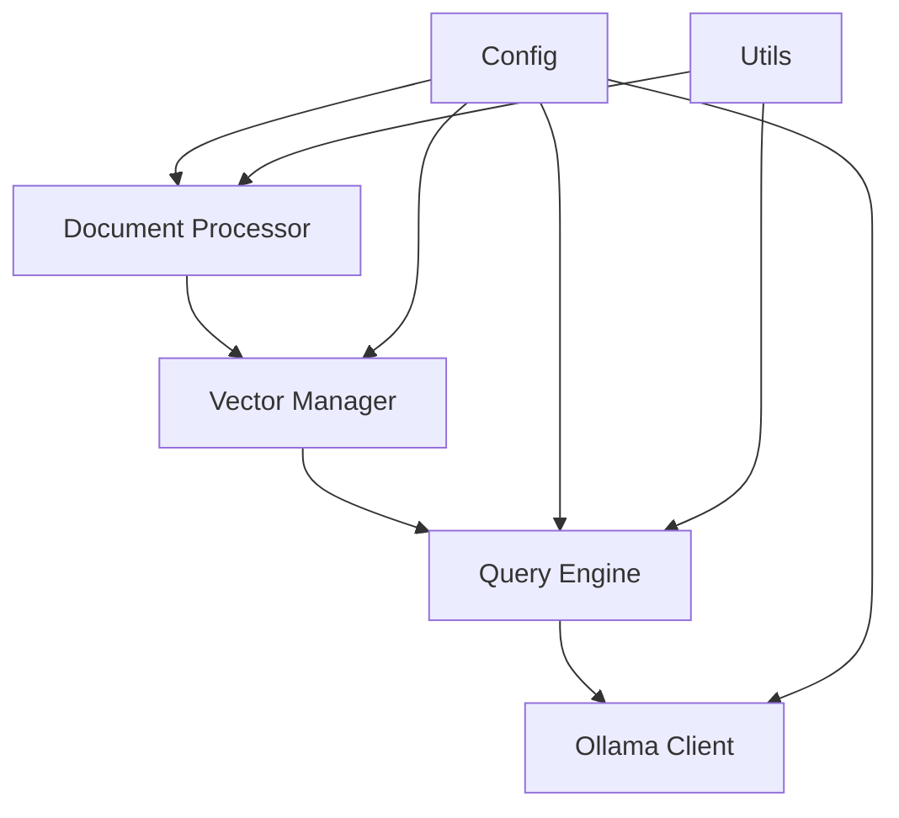

# LLMFixU Kehittäjän opas

## Kehitysympäristön asetukset

### Vaaditut työkalut

- Python 3.8+
- Docker & Docker Compose
- Git
- IDE (suositus: VS Code)

### Kehitysympäristön pystytys

```bash
# Kloonaa repo
git clone https://github.com/mxxx222/llmfixu.git
cd llmfixu

# Luo virtuaaliympäristö
python3 -m venv venv
source venv/bin/activate

# Asenna kehitysriippuvuudet
pip install -r requirements.txt
pip install -r requirements-dev.txt

# Kopioi konfiguraatio
cp .env.example .env

# Käynnistä palvelut
docker-compose up -d

# Asenna pre-commit hookit
pre-commit install
```

### VS Code asetukset

`.vscode/settings.json`:
```json
{
    "python.defaultInterpreterPath": "./venv/bin/python",
    "python.linting.enabled": true,
    "python.linting.flake8Enabled": true,
    "python.formatting.provider": "black",
    "python.testing.pytestEnabled": true,
    "python.testing.pytestArgs": ["tests/"]
}
```

## Projektin arkkitehtuuri

### Hakemistorakenne

```
src/llmfixu/
├── __init__.py
├── api/                    # Ulkoiset rajapinnat
│   ├── ollama_client.py   # LLM-asiakasohjelma
│   └── query_engine.py    # Kysely-engine
├── config/                # Konfiguraatio
│   └── settings.py        # Asetukset
├── processors/            # Tiedonkäsittely
│   ├── document_processor.py  # Dokumenttien käsittely
│   └── vector_manager.py      # Vektorietietokanta
└── utils/                 # Apuvälineet
    └── helpers.py         # Yleiset funktiot
```

### Komponenttien välinen kommunikaatio



### Tiedonkulku

1. **Dokumenttien syöttö**: DocumentProcessor → VectorManager
2. **Kyselyt**: QueryEngine → VectorManager + OllamaClient
3. **Konfiguraatio**: settings.py → kaikki komponentit

## Koodaustyyli

### Python Style Guide

Noudatamme [PEP 8](https://pep8.org/) -standardia seuraavilla lisäyksillä:

- **Rivileveys**: Maksimi 88 merkkiä (Black default)
- **Imports**: Käytä absolute importteja
- **Docstringit**: Google-tyyli
- **Type hints**: Pakollisia kaikissa funktioissa

### Esimerkki

```python
"""
Esimerkki moduulista.
"""

from typing import List, Dict, Optional
import logging

logger = logging.getLogger(__name__)


class ExampleClass:
    """Example class for demonstration.
    
    This class shows how to structure code according to our standards.
    
    Attributes:
        name: The name of the example.
        value: An optional value.
    """
    
    def __init__(self, name: str, value: Optional[int] = None):
        """Initialize the example.
        
        Args:
            name: The name to set.
            value: Optional value to store.
        """
        self.name = name
        self.value = value
        logger.info(f"Created example: {name}")
    
    def process_data(self, items: List[str]) -> Dict[str, int]:
        """Process a list of items.
        
        Args:
            items: List of string items to process.
            
        Returns:
            Dictionary mapping items to their lengths.
            
        Raises:
            ValueError: If items list is empty.
        """
        if not items:
            raise ValueError("Items list cannot be empty")
        
        result = {}
        for item in items:
            result[item] = len(item)
        
        return result
```

### Commit-viestit

Käytämme [Conventional Commits](https://www.conventionalcommits.org/) -formaattia:

```
type(scope): description

[optional body]

[optional footer]
```

**Tyypit:**
- `feat`: Uusi ominaisuus
- `fix`: Bugikorjaus
- `docs`: Dokumentaatio
- `style`: Koodin formatointi
- `refactor`: Koodin refaktorointi
- `test`: Testien lisäys
- `chore`: Ylläpitotehtävät

**Esimerkkejä:**
```
feat(query): add support for multiple models
fix(vector): resolve connection timeout issue
docs(api): update query engine documentation
test(processor): add tests for chunk_content function
```

## Testaaminen

### Testirakenteess

```
tests/
├── conftest.py              # Pytest konfiguraatio
├── unit/                    # Yksikkötestit
│   ├── test_document_processor.py
│   ├── test_vector_manager.py
│   └── test_query_engine.py
├── integration/             # Integraatiotestit
│   ├── test_full_pipeline.py
│   └── test_api_integration.py
└── fixtures/                # Testidatat
    ├── sample.pdf
    └── sample.txt
```

### Testien ajaminen

```bash
# Kaikki testit
pytest

# Yksittäinen testi
pytest tests/unit/test_document_processor.py

# Coverage
pytest --cov=src/llmfixu --cov-report=html

# Pitkät testit (vaatii Docker)
pytest -m integration
```

### Testien kirjoittaminen

```python
import pytest
from unittest.mock import Mock, patch
from src.llmfixu.processors.document_processor import DocumentProcessor


class TestDocumentProcessor:
    """Tests for DocumentProcessor class."""
    
    @pytest.fixture
    def processor(self):
        """Create a DocumentProcessor instance for testing."""
        return DocumentProcessor()
    
    def test_chunk_content_basic(self, processor):
        """Test basic content chunking."""
        content = "A" * 2000
        chunks = processor.chunk_content(content, chunk_size=500, overlap=100)
        
        assert len(chunks) > 1
        assert all(len(chunk) <= 500 for chunk in chunks)
        assert chunks[0][:400] in chunks[1]  # Overlap check
    
    def test_chunk_content_empty(self, processor):
        """Test chunking with empty content."""
        chunks = processor.chunk_content("")
        assert chunks == [""]
    
    @patch('src.llmfixu.processors.document_processor.PyPDF2')
    def test_extract_pdf_content(self, mock_pdf, processor):
        """Test PDF content extraction."""
        # Mock PyPDF2
        mock_reader = Mock()
        mock_page = Mock()
        mock_page.extract_text.return_value = "Test content"
        mock_reader.pages = [mock_page]
        mock_pdf.PdfReader.return_value = mock_reader
        
        result = processor._extract_pdf_content("test.pdf")
        assert result == "Test content"
```

### Integraatiotestit

```python
import pytest
from src.llmfixu.api.query_engine import QueryEngine


@pytest.mark.integration
class TestQueryEngineIntegration:
    """Integration tests for QueryEngine."""
    
    @pytest.fixture
    def engine(self):
        """Create QueryEngine with real services."""
        return QueryEngine()
    
    def test_full_query_pipeline(self, engine):
        """Test complete query pipeline."""
        # Add test document
        test_doc = {
            'content': 'This is a test document about security.',
            'metadata': {'file_name': 'test.txt'}
        }
        engine.vector_manager.add_documents([test_doc])
        
        # Query
        result = engine.query("What does the document say about security?")
        
        assert result['answer']
        assert result['confidence'] > 0
        assert len(result['sources']) > 0
```

## Dokumentaatio

### Docstring-formaatti

Käytämme Google-tyylistä docstring-formaattia:

```python
def complex_function(
    param1: str, 
    param2: List[int], 
    param3: Optional[Dict[str, Any]] = None
) -> Tuple[bool, str]:
    """One-line summary of the function.
    
    Longer description that explains what the function does,
    how it works, and any important details.
    
    Args:
        param1: Description of parameter 1.
        param2: Description of parameter 2.
        param3: Optional description of parameter 3.
            Can span multiple lines if needed.
    
    Returns:
        Tuple containing:
            - bool: Success status
            - str: Result message or error description
    
    Raises:
        ValueError: If param1 is empty.
        TypeError: If param2 contains non-integers.
    
    Example:
        >>> result = complex_function("test", [1, 2, 3])
        >>> print(result)
        (True, "Success")
    """
    pass
```

### API-dokumentaatio

API-dokumentaatio generoidaan automaattisesti docstringeistä:

```bash
# Generoi dokumentaatio
pdoc --html --output-dir docs/api src/llmfixu
```

## Debugging

### Logging

```python
import logging

# Moduulin logger
logger = logging.getLogger(__name__)

# Käyttö
logger.debug("Detailed information for debugging")
logger.info("General information")
logger.warning("Warning message")
logger.error("Error message")
logger.critical("Critical error")
```

### Debug-tila

```bash
# Ympäristömuuttuja
export LOG_LEVEL=DEBUG

# Tai käytä debug-skriptiä
python scripts/debug.py
```

### Debugger

```python
# Lisää breakpoint
import pdb; pdb.set_trace()

# Tai Python 3.7+
breakpoint()

# VS Code debugger
# Aseta breakpoint klikkaamalla rivinumeroa
```

### Profiling

```python
import cProfile
import pstats

# Profiloi funktio
cProfile.run('function_to_profile()', 'profile_stats')

# Analysoi tulokset
stats = pstats.Stats('profile_stats')
stats.sort_stats('cumulative')
stats.print_stats(10)
```

## CI/CD Pipeline

### GitHub Actions

`.github/workflows/test.yml`:
```yaml
name: Tests

on: [push, pull_request]

jobs:
  test:
    runs-on: ubuntu-latest
    
    services:
      docker:
        image: docker:dind
        options: --privileged
    
    steps:
    - uses: actions/checkout@v3
    
    - name: Set up Python
      uses: actions/setup-python@v4
      with:
        python-version: '3.9'
    
    - name: Install dependencies
      run: |
        pip install -r requirements.txt
        pip install -r requirements-dev.txt
    
    - name: Lint with flake8
      run: flake8 src/ scripts/
    
    - name: Check formatting with black
      run: black --check src/ scripts/
    
    - name: Type check with mypy
      run: mypy src/
    
    - name: Run unit tests
      run: pytest tests/unit/ --cov=src/llmfixu
    
    - name: Start services
      run: docker-compose up -d
    
    - name: Wait for services
      run: sleep 30
    
    - name: Run integration tests
      run: pytest tests/integration/
```

### Pre-commit hooks

`.pre-commit-config.yaml`:
```yaml
repos:
  - repo: https://github.com/psf/black
    rev: 23.3.0
    hooks:
      - id: black
        language_version: python3

  - repo: https://github.com/pycqa/flake8
    rev: 6.0.0
    hooks:
      - id: flake8

  - repo: https://github.com/pre-commit/mirrors-mypy
    rev: v1.3.0
    hooks:
      - id: mypy
        additional_dependencies: [types-requests]
```

## Versionhallinta

### Git workflow

1. **Feature branches**: `feature/feature-name`
2. **Bugfix branches**: `bugfix/issue-number`
3. **Release branches**: `release/v1.2.3`
4. **Hotfix branches**: `hotfix/critical-fix`

### Branching-strategia

```bash
# Uusi feature
git checkout -b feature/add-pdf-support main
# Kehitä feature
git commit -m "feat(processor): add PDF support"
# Push ja tee PR
git push origin feature/add-pdf-support
```

### Release-prosessi

```bash
# Luo release branch
git checkout -b release/v1.1.0 main

# Päivitä versio
echo "1.1.0" > VERSION

# Commit ja tag
git commit -m "chore: bump version to 1.1.0"
git tag v1.1.0

# Merge takaisin
git checkout main
git merge release/v1.1.0
git push origin main --tags
```

## Suorituskyvyn optimointi

### Profiling

```python
# Aikamittaus
import time
start = time.time()
# ... koodi ...
print(f"Aika: {time.time() - start:.2f}s")

# Memory profiling
from memory_profiler import profile

@profile
def memory_intensive_function():
    # ... koodi ...
    pass
```

### Async/await

```python
import asyncio
import aiohttp

async def fetch_data(url: str) -> str:
    """Asynchronous data fetching."""
    async with aiohttp.ClientSession() as session:
        async with session.get(url) as response:
            return await response.text()

async def main():
    """Main async function."""
    tasks = [
        fetch_data("http://api1.com"),
        fetch_data("http://api2.com"),
    ]
    results = await asyncio.gather(*tasks)
    return results
```

### Caching

```python
from functools import lru_cache
import redis

# LRU cache
@lru_cache(maxsize=128)
def expensive_computation(param: str) -> str:
    # ... kallis laskenta ...
    return result

# Redis cache
redis_client = redis.Redis(host='localhost', port=6379, db=0)

def cached_function(key: str) -> str:
    # Hae cachesta
    cached = redis_client.get(key)
    if cached:
        return cached.decode()
    
    # Laske ja tallenna
    result = expensive_computation(key)
    redis_client.setex(key, 3600, result)  # 1h TTL
    return result
```

## Turvallisuus

### Dependency scanning

```bash
# Tarkista haavoittuvuudet
pip-audit

# Päivitä riippuvuudet
pip-review --local --interactive
```

### Secrets management

```python
import os
from typing import Optional

def get_secret(key: str, default: Optional[str] = None) -> str:
    """Get secret from environment or file."""
    # Ensin ympäristömuuttujista
    value = os.getenv(key)
    if value:
        return value
    
    # Sitten tiedostosta
    secret_file = f"/run/secrets/{key.lower()}"
    if os.path.exists(secret_file):
        with open(secret_file) as f:
            return f.read().strip()
    
    if default is not None:
        return default
    
    raise ValueError(f"Secret {key} not found")
```

### Input validation

```python
from typing import Union
import re

def validate_input(data: str, pattern: str) -> bool:
    """Validate input against pattern."""
    return bool(re.match(pattern, data))

def sanitize_filename(filename: str) -> str:
    """Sanitize filename for safe storage."""
    # Poista vaaralliset merkit
    safe_chars = re.sub(r'[^\w\-_\.]', '_', filename)
    return safe_chars[:255]  # Rajoita pituus
```

## Deployment

### Docker

```dockerfile
# Dockerfile
FROM python:3.9-slim

WORKDIR /app

# Asenna riippuvuudet
COPY requirements.txt .
RUN pip install --no-cache-dir -r requirements.txt

# Kopioi koodi
COPY src/ ./src/
COPY scripts/ ./scripts/

# Aseta käyttäjä
RUN useradd --create-home --shell /bin/bash app
USER app

# Käynnistä sovellus
CMD ["python", "scripts/query_system.py", "-i"]
```

### Docker Compose tuotantoon

```yaml
# docker-compose.prod.yml
version: '3.8'

services:
  llmfixu-app:
    build: .
    environment:
      - LOG_LEVEL=INFO
      - OLLAMA_URL=http://ollama:11434
    volumes:
      - ./data:/app/data:ro
    depends_on:
      - ollama
      - chromadb
    restart: unless-stopped

  nginx:
    image: nginx:alpine
    ports:
      - "80:80"
      - "443:443"
    volumes:
      - ./nginx.conf:/etc/nginx/nginx.conf:ro
      - ./ssl:/etc/ssl:ro
    depends_on:
      - llmfixu-app
    restart: unless-stopped
```

### Monitoring

```python
# Prometheus metrics
from prometheus_client import Counter, Histogram, start_http_server

# Metrics
REQUEST_COUNT = Counter('requests_total', 'Total requests')
REQUEST_DURATION = Histogram('request_duration_seconds', 'Request duration')

def monitored_function():
    """Function with monitoring."""
    REQUEST_COUNT.inc()
    
    with REQUEST_DURATION.time():
        # ... funktio ...
        pass

# Käynnistä metrics server
start_http_server(8000)
```

## Kontribuutio

### Pull Request prosessi

1. **Fork** repository
2. **Luo feature branch**
3. **Tee muutokset** ja kirjoita testit
4. **Varmista** että testit menevät läpi
5. **Lähetä Pull Request**

### Code Review

**Checklist reviewointiin:**
- [ ] Koodi noudattaa style guidea
- [ ] Testit on kirjoitettu ja ne menevät läpi
- [ ] Dokumentaatio on päivitetty
- [ ] Ei security-ongelmia
- [ ] Performance ei heikentynyt merkittävästi
- [ ] Breaking changes on dokumentoitu

### Issue templates

```markdown
**Bug report template:**

## Expected Behavior
What should happen?

## Actual Behavior
What actually happens?

## Steps to Reproduce
1. Step 1
2. Step 2
3. ...

## Environment
- OS: 
- Python version:
- Docker version:
- LLMFixU version:

## Additional Context
Any other context about the problem.
```

## Yhteenveto

Tämä opas kattaa LLMFixU-projektin kehittämisen keskeiset käytännöt. Muista:

1. **Noudata koodausstandardeja**
2. **Kirjoita testit**
3. **Dokumentoi muutokset**
4. **Käytä branching-strategiaa**
5. **Tee code review**

Lisätietoja löydät projektin [GitHubista](https://github.com/mxxx222/llmfixu).